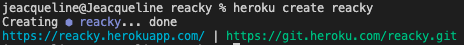

# Reacky 🤓

Welcome to my personal portfolio! This repository showcases my skills, projects, and experiences as a web developer and project manager. It serves as a platform for me to share my work with fellow developers, collaborate on future projects, and connect with potential employers and clients. 📝

## Table of Contents
- [Introduction](#introduction)
- [Features](#features)
- [Usage](#usage)
- [Deployment](#deployment)
- [Screenshots](#screenshots)

## Features
The portfolio application provides the following features:

- Header
- Navigation: The navigation menu consists of the following titles:
  - About Me
  - Portfolio
  - Contact
  - Resume
- Dynamic Content
- Default Selection
- About Me
- Portfolio
- Contact
- Resume
- Footer
## Usage
To use the portfolio application locally, follow these steps:

- Clone the repository: `git clone <repository-url>`
- Navigate to the project directory: `cd <project-directory>`
- Install the dependencies: `npm install`
- Start the development server: `npm start`
- Open your web browser and visit: `http://localhost:3000`

## Screenshots

[GitHub/Jeacqueline reacky](https://github.com/Jeacqueline/reacky)

[Heroku/Jeacqueline Reacky]()
